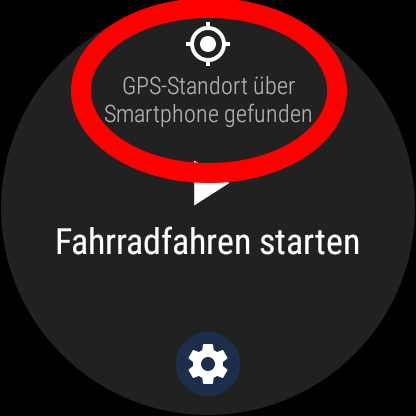

# Fit Helper
A Macrodroid macro to fix problems with Google Fit (Android Phone &amp; Wear OS watch).  
This often happens because some carriers (OnePlus, Samsung, etc.) optimize their battery, and disable GPS in sleep mode.

# How to install &amp; use
## 1. - Downloading the macro
Download Fit Helper through the Macrodroid store:  
Base macro: http://www.macrodroid.com/macrostore?id=5594  
Wear OS Add-on: http://www.macrodroid.com/macrostore?id=5595

You could also type "Fit Helper" in the search of the Macrodroid store.  

Alternatively, download "Fit Helper.macro", and optionally "Fit Helper (Wear OS Add-on).macro", and import them into Macrodroid.

## 2. - Using the macro
### Android Phone
Start a workout, and leave your screen on until the Fit Helper service (in form of a notification) is running.  
Do your workout.
### Wear OS watch
Install the macrodroid app from the Wear OS Play Store, and select "Fit Helper (Wear OS Add-on)".  
Start your workout as usual until you see this screen:  
.
Wait until the GPS-Signal is found. If it won't find it, wake your phone.  
Start it, if it has found a signal and wait about 1 minute, then wake your phone and put it back into sleep mode.  
Do your workout.